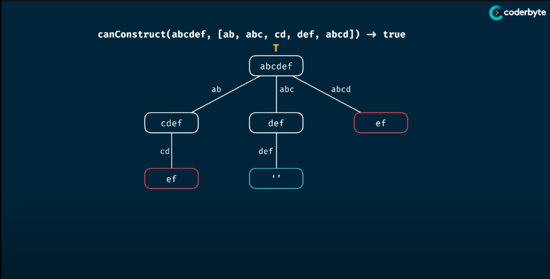

# Can Construct
> Write a function "canConstruct(target, wordBank)" that accepts a target string and an array of strings.
> The function should return a boolean indicating whether the 'target' can be constructed by concatnating elements of the 'wordBank' array.
> 
> You may reuse elements of 'wordBank' as many times as needed.

## Memorisation

> Analysis:
> - Time Complexity: O(n^m) => O(m * n)
> > + Depending on the language, the reslice might cause extra m time conplexity.
> > + For Golang, slice is just a view into underlying array so resclicing does "nothing more" than creating a new slice header, which is constant time operation
> - Space Complexity: O(m)
> where m & n is the length of the target and wordBank
```Golang
package Pattern

import "strings"

func canConstruct(target string, wordBank []string) bool {
    return canConstructHelper(target, wordBank, make(map[string]bool))
}

func canConstructHelper(target string, wordBank []string, memo map[string]bool) bool {
    if result, ok := memo[target]; ok {
        return result
    }
    
    if len(target) == 0 {
        return true
    }
	

    for _, word := range wordBank {
        if strings.HasPrefix(target, word) {
            if canConstructHelper(target[len(word):], wordBank, memo) {
                memo[target] = true
                return true
            }
        }
    }

    memo[target] = false
    return false
}
```

// TODO: Confirm implementation logic
## Tabulation

> Analysis:
> - Time Complexity: O(m^2 * n)
> - Space Complexity: O(m)
> where m & n is the length of the target and wordBank
```Golang
package Pattern

import "strings"

func canConstruct(target string, wordBank []string) bool {
    table := make([]bool, len(target)+1)
	table[0] = true

    for i := 0; i < len(table); i++ {
        if table[i] {
            current := target[i:]
            for _, word := range wordBank {
                if strings.HasPrefix(current, word) {
                    table[i + len(word)] = true
                }
            }
        }
    }

    return table[len(target)]
}
```
