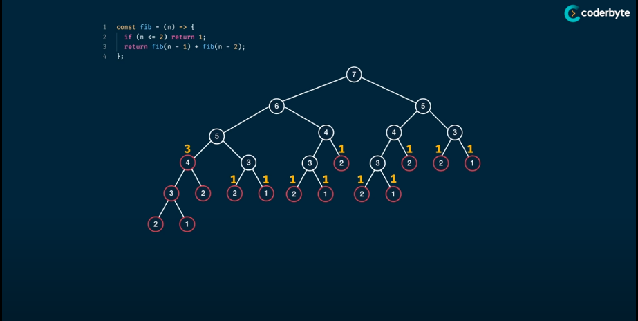

# Dynamic Programming
Ref:
- [Dynamic Programming - Learn to Solve Algorithmic Problems & Coding Challenges](https://www.youtube.com/watch?v=oBt53YbR9Kk)
- [Dynamic Programming with Java – Learn to Solve Algorithmic Problems & Coding Challenges](youtube.com/watch?v=oFkDldu3C_4)
- [Mastering Dynamic Programming - How to solve any interview problem (Part 1)](https://www.youtube.com/watch?v=Hdr64lKQ3e4)
- [Mastering Dynamic Programming - A Real-Life Problem (Part 2)](https://www.youtube.com/watch?v=rE5h11FwiVw)
- [NeetCode](https://www.youtube.com/playlist?list=PLot-Xpze53lcvx_tjrr_m2lgD2NsRHlNO)

## Definition:
Dynamic Programming (DP) is a programming paradigm that can systematically and efficiently explore all possible solutions to a problem. As such, it is capable of
solving a wide variety of problems that often have the following characteristics:
1. The problem can be broken down into "overlapping sub-problems" - smaller versions of the original problem that are re-used multiple times.
2. The problem has an "optimal substructure" - an optimal solution can be formed from optimal solutions to the overlapping sub-problems of the original problem.

## Top-Down (Memoization) approach v.s. Bottom-Up (Tabulation) approach
Ref: https://www.enjoyalgorithms.com/blog/top-down-memoization-vs-bottom-up-tabulation
### Top-Down: implementation of naturally using recursion but modify it to save the solution of each sub-problem in an array or hash table,
then check whether it has previously solved the sub-problem
> Visualise the probelm as a tree
> Implement the tree using recursion
> Work in inefficient way
> Add a memo object (Array or Map)
> Add a base cast to return memo value
> Store the return value to memo
### Bottom-Up: an iterative version of the top-down approach where solution of any problem depends only on the solution of smaller sub-problems.
> Visualise the probelm as a table
> Size the table based on the inputs
> Initialise the table with default values
> Seed the trivial value into the table
> Iterate throught the table and fill further position based on the current position

``` Summary
A bottom-up implementation's runtime is usually faster, as iteration does not have the overhead that recursion does.
A top-down implementation is usually much easier to write because of recursion where the ordering of sub-problems does not matter, whereas with tabulation,
we need to go through a logical ordering of solving sub-problems.

Asymptotically, both of these approaches guarantee the same time complexity, except in unusual circumstances where the top-down approach does not actually
recurse to examine all possible sub-problems.
```


> Using the node value as the state and edge as the transition (value change)
```Golang
// Time Complexity: O(2^n) -> O(n)
// Space Complexity: O(n) -> O(n): The space usage mainly comes from recursive call stack
package DynamicProgramming

func fib(n int) int {
    return fibHelper(n, make(map[int]int))
}

func fibHelper(n int, memo map[int]int) {
    if result, ok := memo[n]; ok {
        return result
    }
    
    if n <= 2 {
        return 1
    }

    memo[n] = fib(n-1, memo) + fib(n-2, memo)
    return memo[n]
}
```
