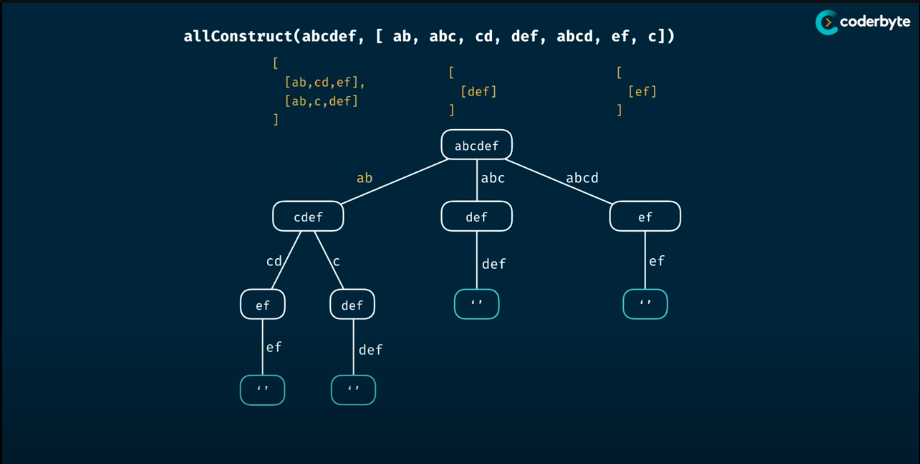

# All Construct
> Write a function "allConstruct(target, wordBank)" that accepts a target string and an array of strings.
> The function should return a 2D array containing all of the ways that the 'target' can be constructed by concatnating elements of the 'wordBank' array. Each elemnet of the 2D array should represent one combination that construct the 'target'
> 
> You may reuse elements of 'wordBank' as many time as needed.
>
> Related Topic: 113. Path Sum II: https://leetcode.com/problems/path-sum-ii/
>
> Analysis:
> - Time Complexity: O(n^m)
> - Space Complexity: O(m)
> where m & n is the length of the target and wordBank

## Memorisation

```Golang
package Pattern

func allConstruct(target, wordBank string) [][]string {
    return allConstructHelper(target, wordBank, make(map[string][][]string))
}

func allConstructHelper(target string, wordBank []string, memo map[string][][]string) [][]string {
    if value, ok := memo[target] {
        return value
    }
    
    if len(target) == 0 {
        return make([][]string, 0)
    }

    result := make([][]string, 0)
    for _, word := range wordBank {
        if strings.HasPrefix(target, word) {
            target = target[len(word):]
            elements = allConstructHelper(target, wordBank, memo)
            for _, element := range elements {
                element = append(element, word)
            }

            result = append(result, element...)
        }
    }

    memo[target] = result
    return result
}
```