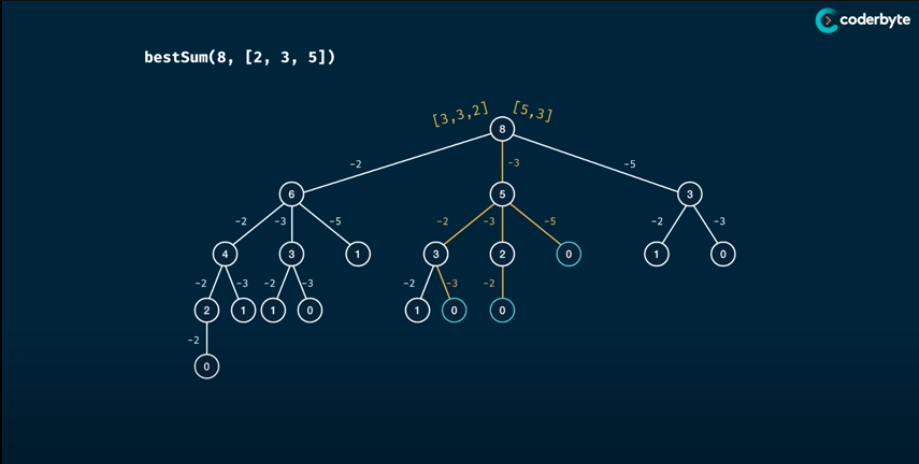
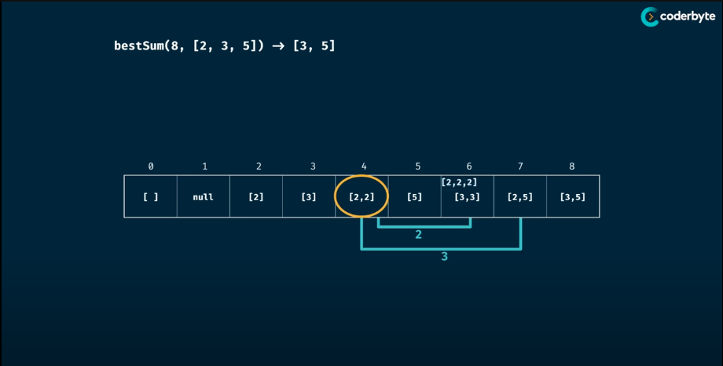

# How Sum
> Write a function "bestSum(targetSum, numbers)" taht take in a targetSum and an array of numbers as arguments.
> The function should return an array containing the shortest combination of numbers that add up to exactly the targetSum.
> 
> If there is a tie for the shortest combination, you may return any one of the shortest.

## Memorisation

> Analysis:
> - Time Complexity: O(n^m * m) => (n * m^2)
> - Space Complexity: O(m^2)
> > - In additional to call stacks, every recursive call will have its own bestResult slice which will result in O(m) space complexity
> > - After memorisation the usage mainly comes from memo object which includes keys and and array
> where m is the targetSum and n is the length of the numbers
```Golang
package Pattern

func bestSum(targetSum, numbers int) []int] {
    return bestSumMemoHelper(targetSum, numbers, make(map[int][]int))
}

func bestSumMemoHelper(targetSum, numbers int, memo map[int][]int) []int {
    if result, ok := memo[targetSum]; ok {
        return result
    }

    if targetSum < 0 {
        return nil
    }
    if targetSum == 0 {
        return []int{}
    }

    bestResult := make([]int, 0)
    for _, num := range numger {
        remainder := targetSum - num
        result := bestSumMemoHelper(remainder, numbers, memo)

        if result != nil && len(result)+1 < len(bestResult) {
            bestResult = append(result, num)
        }
    }

    memo[targetSum] = bestResult
    return bestResult
}
```

## Tabulation

> Analysis:
> - Time Complexity: O(m * n * m)
> - Space Complexity: O(m^2)
> where m is the targetSum and n is the length of the numbers
```Golang
package Pattern

func bestSum(targetSum, numbers int) []int {
    table := make([][]int, targetSum+1)

    table[0] = make([]int, 0)
    for i := 0; i < targetSum; i++ {
        if table[i] != nil {
            for _, num := range numbers {
                if  i+num <= targetSum && (table[i+num] == nil || len(table[i])+1 < len(table[i+num])) {
                    p := make([]int, len(table[i])+1)
                    copy(p, table[i])
                    table[i+num] = append(p, num)
                } 
            }
        }
    }

    return table[targetSum]
}
```
