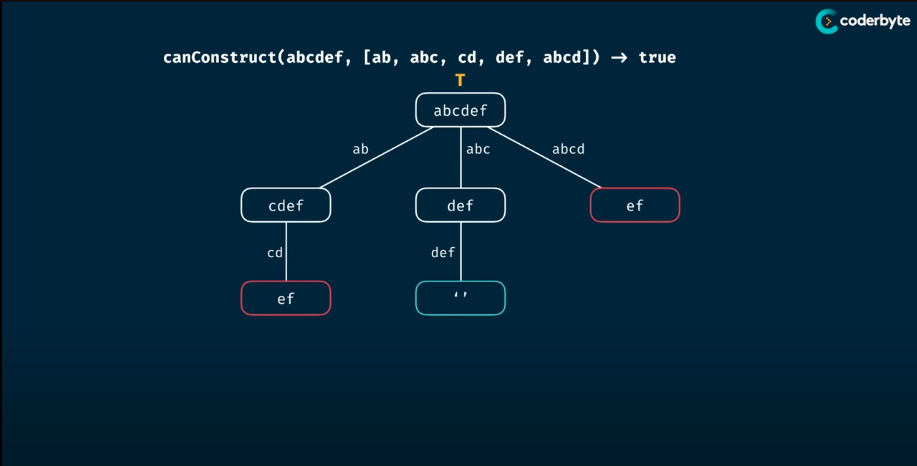

# Can Construct
> Write a function "canConstruct(target, wordBank)" that accepts a target string and an array of strings.
> The function should return a boolean indicating whether or not the 'target' can be constructed by concatnating elements of the 'wordBank' array.
> 
> You may reuse elements of 'wordBank' as many time as needed.
>
> Analysis:
> - Time Complexity: O(n^m) => O(n * m)
> > + Depending on the language, the reslice might cause extra m time conplexity.
> > + For Golang, slice is just a view into underlying array so resclicing does "nothing more" than creating a new slice header, which is constant time operation
> - Space Complexity: O(m) => O(m)
> where m & n is the length of the target and wordBank

## Memorisation

```Golang
package Pattern

func canConstruct(target, wordBank string) bool {
    return canConstructHelper(target, wordBank, make(map[string]bool))
}

func canConstructHelper(target, wordBank string, memo map[string]bool) bool {
    if result. ok := memo[target]; ok {
        return result
    }
    
    if len(target) == 0 {
        return true
    }

    for _, word := wordBank {
        if strings.HasPrefix(target, word) {
            if canConstruct(target[len(word:)], wordBank, memo) {
                memo[target] = true
                return true
            }
        }
    }

    memo[target] = false
    return false
}
```