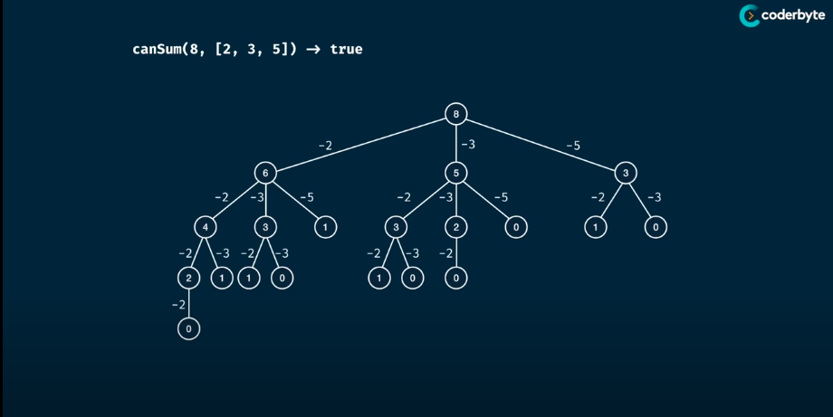
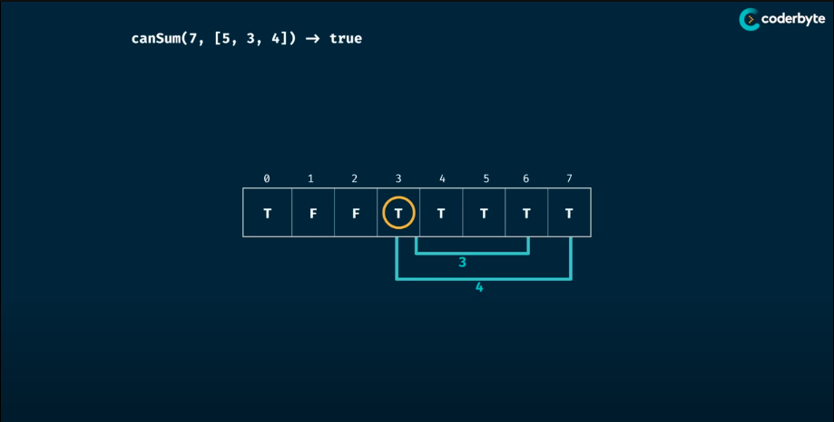

# Can Sum
> Write a function "canSum(targetSum, numbers)" taht take in a targetSum and an array of numbers as arguments.
> The function should return a boolean indicating whether or not it is possible to generate the targetSum using numbers from the array.
> 
> You may use an element of the array as many time as needed.
> You may assume that all input numbers are nonnegative.
>
> Related Topic: 112. Path Sum: https://leetcode.com/problems/path-sum/


## Memorisation

> Analysis:
> - Time Complexity: O(n^m) => O(m * n)
> - Space Complexity: O(m) => O(m)
> where m is the targetSum and n is the length of the numbers
```Golang
package Pattern

func canSum(targetSum, numbers int) bool {
    return canSumMemoHelper(targetSum, numbers, make(map[int]bool))
}

func canSumMemoHelper(targetSum, numbers int, memo map[int]bool) bool {
    if result, ok := memo[targetSum]; ok {
        return result
    }

    if targetSum < 0 {
        return false
    }
    if targetSum == 0 {
        return true
    }

    for _, num := range numger {
        remainder := targetSum - num
        if canSumMemoHelper(remainder, numbers, memo) {
            memo[targetSum] = true
            return true
        }
    }

    memo[targetSum] = false
    return false
}
```

## Tebulation

> Analysis:
> - Time Complexity: O(m * n)
> - Space Complexity: O(m * n)
> where m is the targetSum and n is the length of the numbers
```Golang
package Pattern

func canSum(targetSum, numbers int) bool {
    table := make([]bool, targetSum+1)

    table[0] = false
    for i := 0; i < targetSum; i++ {
        if table[i] {
            for _, num := range numbers {
                if i+num <= targetSum {
                    table[i+num] = true
                } 
            }
        }
    }

    return table[targetSum]
}
```