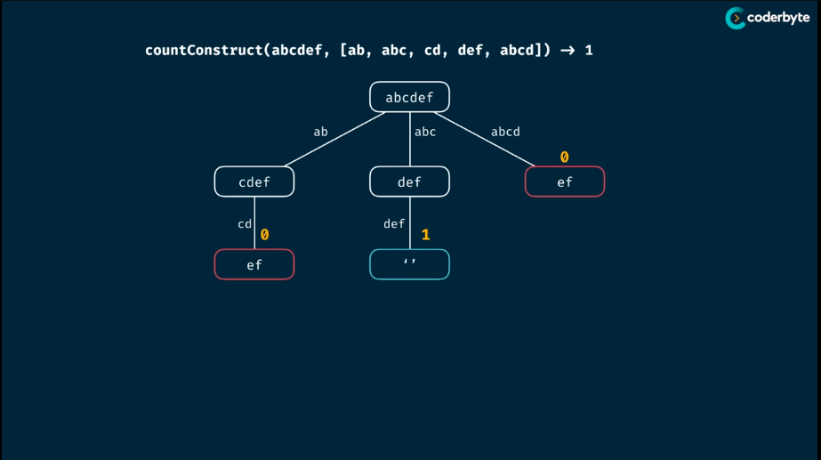
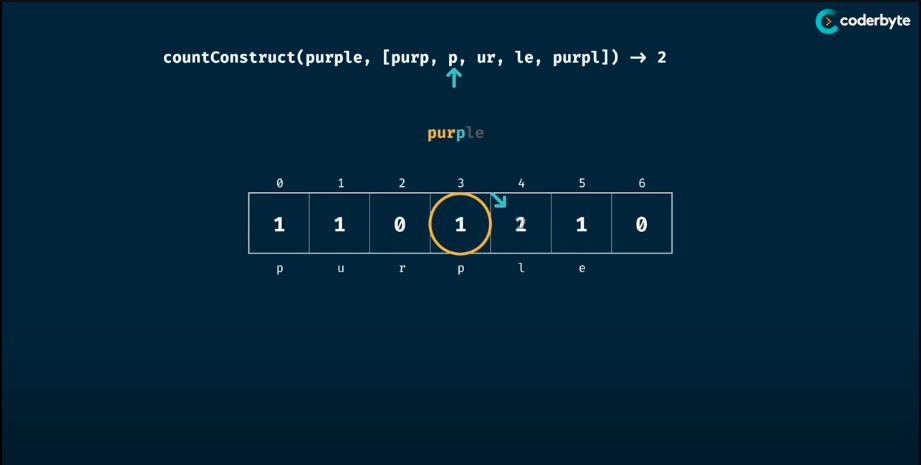

# Count Construct
> Write a function "countConstruct(target, wordBank)" that accepts a target string and an array of strings.
> The function should return a the number of ways that the 'target' can be constructed by concatnating elements of the 'wordBank' array
> 
> You may reuse elements of 'wordBank' as many time as needed.
>
> Related Topic: 437. Path Sum III: https://leetcode.com/problems/path-sum-iii/

## Memorisation

> Analysis:
> - Time Complexity: O(n^m) => O(n * m)
> - Space Complexity: O(m)
> where m & n is the length of the target and wordBank
```Golang
package Pattern

func countConstruct(target, wordBank string) int {
    return canConstructHelper(target, wordBank, make(map[string]int))
}

func countConstructHelper(target, wordBank string, memo map[string]int) int {
    if result. ok := memo[target]; ok {
        return result
    }
    
    if len(target) == 0 {
        return 1
    }

    count := 0
    for _, word := wordBank {
        if strings.HasPrefix(target, word) {
            count += countConstructHelper(target[len(word:)], wordBank, memo)
        }
    }

    memo[target] = count
    return count
}
```

## Tabulation

> Analysis:
> - Time Complexity: O(m^2*n) => O(n * m)
> - Space Complexity: O(m)
> where m & n is the length of the target and wordBank
```Golang
package Pattern

func countConstruct(target, wordBank string) int {
    table := make([]int, len(target)+1)
    talbe[0] = 1

    for i := 0; i < len(table); i++ {
        current := target[i:]
        for _, word := range wordBank {
            if strings.HasPrefix(current, word) {
                table[i + len(word)] += table[i]
            }
        }
    }

    return table[len(target)]
}
```