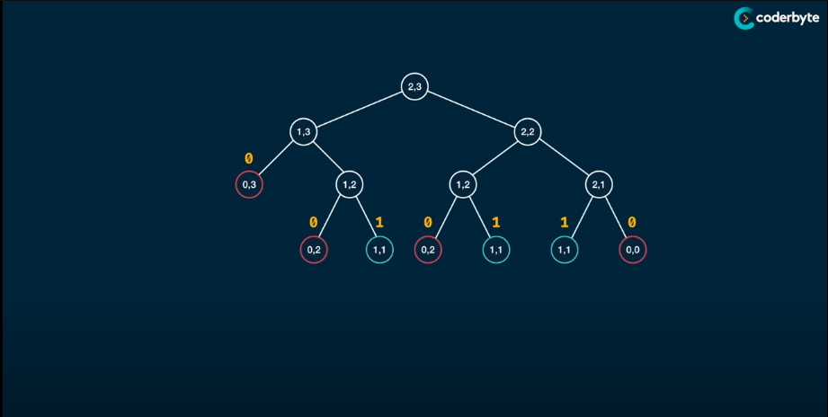
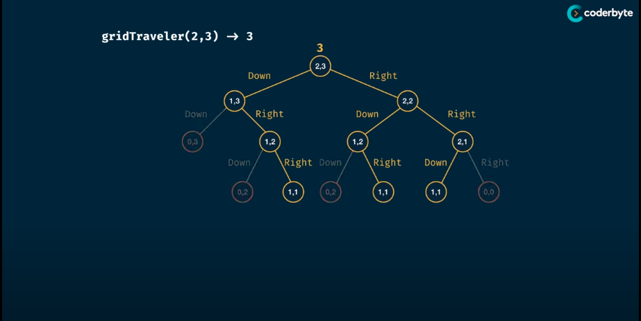
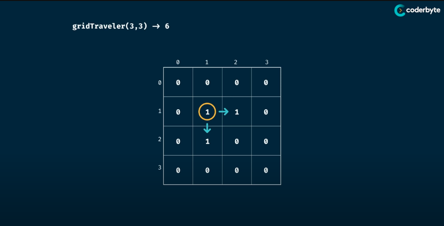

# Grid Traveler
> Says that you are a traveler on a 2D grid. You begin in the top-left conner and your goal is to travel to the bottom-right corner.
> You may only move down or right.
>
> In how many ways can you travel to the goal on a grid with dimensions m * n

## Memorisation


> Analysis:
> - Time Complexity: O(2^(m + n)) => O(m * n)
> - Space Complexity: O(m + n) => O(m + n)
> > The space usage depends on the height of the tree of the call stack which is the sum of the dimensions
```Golang
package Pattern

import "fmt"

func gridTraveler(m, n int) int {
	return gridTravelerMemoHelper(m, n, make(map[string]int))
}

// Memorise:
// - Find the same pattern
// - gridTraveler(a, b) == gridTraveler(b, a)
func gridTravelerMemoHelper(m, n int, memo map[string]int) int {
	key := fmt.Sprint(m, ',', n)
	if result, ok := memo[key]; ok {
		return result
	}

	if m == 0 || n == 0 {
		return 0
	}

	if m == 1 && n == 1 {
		return 1
	}

	memo[key] = gridTravelerMemoHelper(m-1, n, memo) + gridTravelerMemoHelper(m, n-1, memo)
	return memo[key]
}
```

## Tabulation

> Analysis:
> - Time Complexity: O(m * n)
> - Space Complexity: O(m * n)
```Golang
package Pattern

func gridTraveler(m, n int) int {
	// Create 1 element more of each dimension table for easier mapping
	table := make([][]int, m+1)
	for i := range table {
		table[i] = make([]int, n+1)
	}

	// Initialise the default value and seed the base value (depending on the problem) to the table
	table[1][1] = 1

	for i := 0; i < m; i++ {
		for j := 0; j < n; j++ {
			if i < m {
				table[i+1][j] += table[i][j]
			}
			if j < n {
				table[i][j+1] += table[i][j]
			}
		}
	}
	return table[m][n]
}
```

