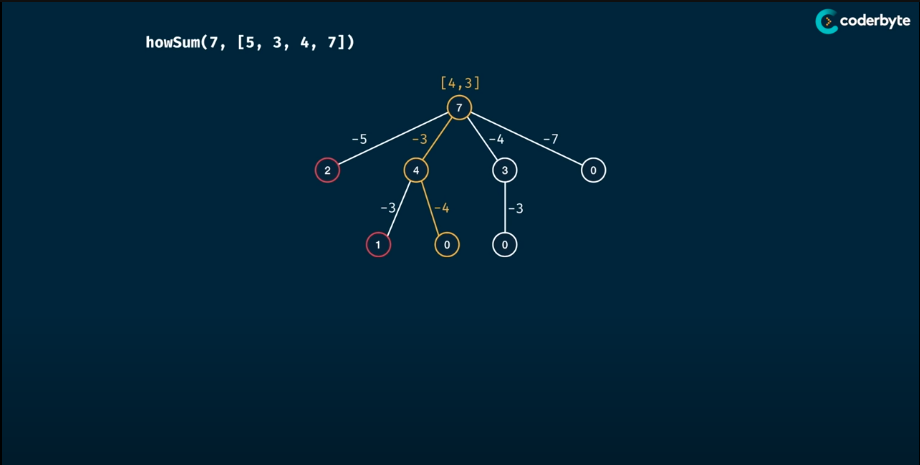

# How Sum
> Write a function "howSum(targetSum, numbers)" taht take in a targetSum and an array of numbers as arguments.
> The function should return an array containing any combination of elements that add up to exactly the targetSum.
> If there is no combination that add up to the targetSum, then return null.
> 
> If there are multiple combinations possible, you may return any single one.
>
> Analysis:
> - Time Complexity: O(n^m * m) => (n * m^2)
> > + Based on the tree structure, there should be exponential number of nodes which will be the branching factor to the height power
> > + The additional operation of adding new element to the result should cause extra m time complexity in worst cases
> > + PS: Golang append(): The amortized cost is O(1), but the worst-case cost is O(N).
> - Space Complexity: O(m) => O(m^2)
> > The space usage originally comes from recursive call stack; after memorisation the usage mainly comes from memo object which includes keys and array
> where m is the targetSum and n is the length of the numbers

## Memorisation

```Golang
package Pattern

func howSum(targetSum, numbers int) []int] {
    return howSumMemoHelper(targetSum, numbers, make(map[int][]int))
}

func howSumMemoHelper(targetSum, numbers int, memo map[int][]int) []int {
    if result, ok := memo[targetSum]; ok {
        return result
    }

    if targetSum < 0 {
        return nil
    }
    if targetSum == 0 {
        return []int{}
    }

    for _, num := range numger {
        remainder := targetSum - num
        result := howSumMemoHelper(remainder, numbers, memo)
        if result != nil {
            result = append(result, num)
            memo[targetSum] = result
            return memo[targetSum]
        }
    }

    memo[targetSum] = nil
    return nil
}
```

## Tabulation
