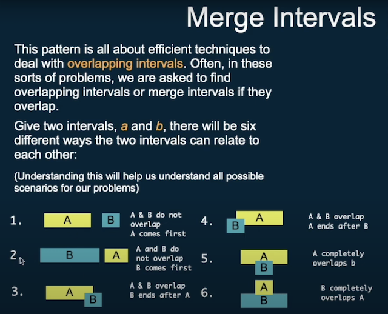
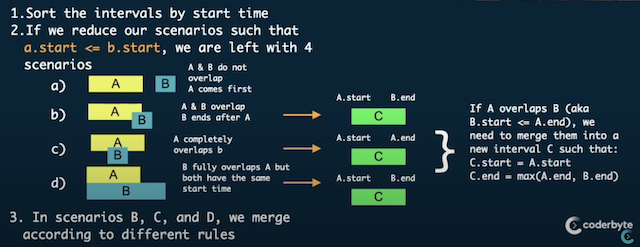

# Merge
Ref:
- [Crash Course for Solving Merge Interval Coding Challenges - I](https://www.youtube.com/watch?v=5rFZIPNH0Yw)
- [Crash Course for Solving Merge Interval Coding Challenges - II](https://www.youtube.com/watch?v=kID_lmQfCKw)
- [Crash Course for Solving Merge Interval Coding Challenges - III](https://www.youtube.com/watch?v=8Ky8B8CGZV0)

## Concepts
This pattern is all about efficient techniques to deal with **overlapping intervals**. Often, in these sorts of problems, 
we are asked to find overlapping intervals or merge intervals if they overlap.
Given 2 intervals, a and b, there will be 6 different ways the 2 intervals to relate to each other:

### Approach
1. **Sort** the intervals by start time
2. If reducing the scenario such that `a.Start < b.Start`, there are only 4 scenario left:

3. In scenarios B, C, and D, we merge according to different rule.
