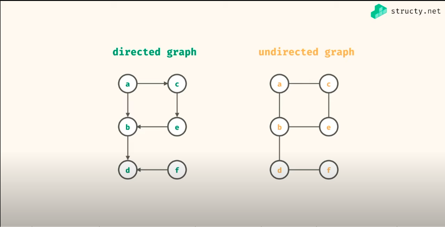
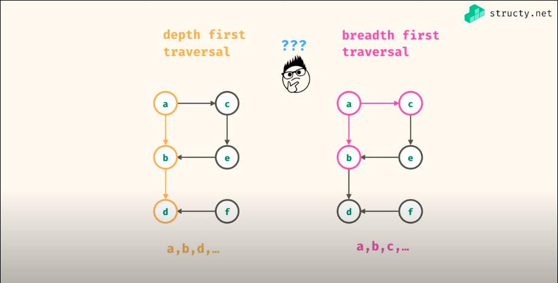

# Graph
Ref:
- [Graph Data Structure with 3 Javascript Implementations](https://www.youtube.com/watch?v=e4RezPkq3UI)
- [Graph Theory Tutorial from a Google Engineer](https://www.youtube.com/watch?v=09_LlHjoEiY)

## Definition
Graph is a data structure made up of **nodes**/**vertices** and **edges** or the connections between nodes.
Tree is a special kind of graph which has only 1 root and 1 unique path between any 2 nodes

### Types of Graphs
- 
> In an **Undirected Graph**, when there is a connection between nodes, it goes both way
> Facebook and its users and the relationship between the users can be modeled as an undirected graph
> In an **Directed Graph**, connection between nodes have direction
> The **degree** of a node is the number of the edges connected to the node
> In a Directed Graph, nodes have an **indegree** or edges pointing to it and an **outdegree** or edges point from it
- Weighted / Unweighted Graphs
> A **Weighted Graph** is a graph in which the edges have values corresponding to weights
> A **Unweighted Graph** has no weights to it edges. so every edge is the same as any other edge
- Cyclic / Acyclic Graphs
> In a **Cyclic Graph**, there is at least one cycle, meaning that there is a path from at least one node back to itself
> An **Acyclic Graph**, means the graph contains no cycle, aka no node can be traversed back to itself

### Traversal


## Graph Representation & Implementation
### Adjacent List
```Golang
package Graph

import "fmt"

type Node struct { Val string }

var(
	graph = map[string][]string {
		"A": {"B", "C"},
		"B": {"D"},
		"C": {"E"},
		"D": {"F"},
		"E": {},
		"F": {},
	}
)

func breadthFirstTraversal(start string) []string {
	result, queue := make([]string, 0), []string{start}]

	for len(queue) > 0 {
		current := queue[0]
		queue = queue[1:]
		result = append(current)

		for _, neighbor := range graph[start] {
			queue = append(queue, neighbor)
		}
	}

	return result
}

func depthFirstTraversal(start string) []string {
	result, stack := make([]string, 0), []string{start}]

	for len(stack) > 0 {
		current := stack[len(stack)-1]
		stack = stack[:len(stack)-1]
		result = append(current)

		for _, neighbor := range graph[start] {
			stack = append(stack, neighbor)
		}
	}

	return result
}

func depthFirstTraversalRecursively(start string)  {
	fmt.Println(start)

	for _, neighbors := range graph[start] {
		// Implicitly base case where neighbors is empty slice
		depthFirstTraversalRecursively(neighbors)
	}
}
```

### Vertex with Edge List
```Golang
package Graph

import "slices"

type Vertex struct{ Val string }

var (
	vertices = []Vertex{
		{"A"},
		{"B"},
		{"C"},
		{"D"},
		{"E"},
	}

	edges = [][]string{
		{"A", "B"},
		{"A", "D"},
		{"B", "C"},
		{"C", "D"},
		{"C", "E"},
		{"D", "E"},
	}
)

func findAdjacentVertices(v Vertex) []string {
	result := make([]string, 0)

	for _, edge := range edges {
		if edge[0] == v.Val {
			result = append(result, edge[1])
		} else if edge[1] == v.Val {
			result = append(result, edge[0])
		}
	}

	return result
}

func isConnected(v1, v2 Vertex) bool {
	for _, edge := range edges {
		if slices.Contains(edge, v1.Val) && slices.Contains(edge, v2.Val) {
			return true
		}
	}

	return false
}
```

### Adjacent Matrix
> A 2-D array filled out with 1's and 0's where each array represents a node and each index in the subarray represents a potential connection to another node
> The value at adjacentMatrix[node1][node2] indicates where there is a connection between node1 and node2
Analysis:
- Time Complexity to find adjacent nodes: O(v) where v is the number of vertices
- Time complexity to check if 2 nodes are connected: O(1)
- Space Complexity: O(v^2) where v is the number of vertices
=> **Great for there are many connections**
```Golang
package Graph

type Vertex struct { Val string }

var (
	vertices = []Vertex{
		{"A"},
		{"B"},
		{"C"},
		{"D"},
		{"E"},
	}

	edges = [][]string{
		{"A", "B"},
		{"A", "D"},
		{"B", "C"},
		{"C", "D"},
		{"C", "E"},
		{"D", "E"},
	}

	vertexIndex    = vertexIndexMap()       // IndexMap: map[A:0 B:1 C:2 D:3 E:4]
	adjacentMatrix = initAdjacentMatrix()	// Matrix: [[0 1 0 1 0] [1 0 1 0 0] [0 1 0 1 1] [1 0 1 0 1] [0 0 1 1 0]]
)

func vertexIndexMap() map[string]int {

	indexMap := make(map[string]int)
	for i, v := range vertices {
		indexMap[v.Val] = i
	}

	return indexMap
}

func initAdjacentMatrix() [][]int {
	indexMap := vertexIndexMap()

	matrix := make([][]int, len(vertices))
	for i := range matrix {
		matrix[i] = make([]int, len(vertices))
	}

	for _, edge := range edges {
		matrix[indexMap[edge[0]]][indexMap[edge[1]]] = 1
		matrix[indexMap[edge[1]]][indexMap[edge[0]]] = 1
	}

	return matrix
}

func findAdjacentVertices(v Vertex) []string {
	indexMap := vertexIndexMap()
	vIdx := indexMap[v.Val]
	result := make([]string, 0)

	for i, v := range adjacentMatrix[vIdx] {
		if v == 1 {
			result = append(result, vertices[i].Val)
		}
	}

	return result
}

func isConnected(v1, v2 Vertex) bool {
	return adjacentMatrix[vertexIndex[v1.Val]][vertexIndex[v2.Val]] == 1
}
```